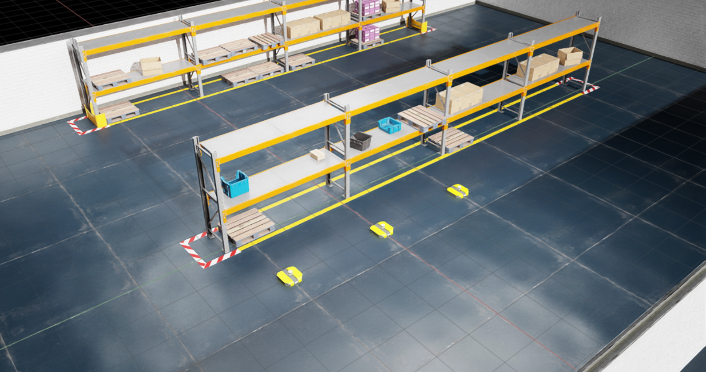

# Running a simulation

## Prerequisite
* Prepared the [two required asset types](preparing-assets.md) to run a simulation with Isaac IMI

## Create a blueprint for the simulation
Each simulation is configured by a single YAML file. This file provides all the information that Isaac IMI needs to run a simulation with Isaac Sim. More information on this file is provided in the [simulation blueprint reference](../reference/simulation-blueprint.md). The YAML file used in this tutorial can be found in `isaacimi/examples/blueprints/dingo_3x_warehouse_two_shelves.yaml`

!!! note
    The location of your YAML file does not matter, you can create it anywhere on your system without a specific folder structure.

Create a `dingo_3x_warehouse_two_shelves.yaml` file, and add the following contents to it:

```yaml title="dingo_3x_warehouse_two_shelves.yaml"
app:
  headless: false
  renderer: RayTracedLighting

world:
  stage_units_in_meters: 1.0
  physics_dt: 0.0166
  rendering_dt: 0.0166
```
The `app` settings configures the Isaac Sim application that will be run. Here, we are launching the GUI with our simulation, and using `RayTracedLighting` as the renderer. The `world` settings configures the world that takes place inside the simulation. Here, we set one unit length in the world equal to one meter, and set the physics and render step size to 0.0166 seconds.

Now, to spawn the AMRs in the environment, we can add the following `scene` settings to the YAML file:

!!! info
    Simulations ran inside a Docker container, as described in the [Docker Deployment](../docker-deployment.md) section, will be ran in headless mode. Any value given to `headless` in the simulation blueprint will be overwritten by `true`. To view headless simulations, download the Isaac Sim WebRTC Streaming Client from the [Isaac Sim website](https://docs.isaacsim.omniverse.nvidia.com/4.5.0/installation/download.html#isaac-sim-latest-release). In your simulation blueprint, set `livestream` to `true` under the `app` setting to start a livestream server when your simulation is run. Finally, run your simulation and connect the WebRTC client to the livestream server. More details on the WebRTC client can be found [here](https://docs.isaacsim.omniverse.nvidia.com/4.5.0/installation/manual_livestream_clients.html).

```yaml title="dingo_3x_warehouse_two_shelves.yaml" hl_lines="10-29"
app:
  headless: false
  renderer: RayTracedLighting

world:
  stage_units_in_meters: 1.0
  physics_dt: 0.0166
  rendering_dt: 0.0166

scene:
  environment:
    usd_path: path/to/warehouse_two_shelves.usd # replace this path with your environment .usd file
    prim_path: /World/environment
  robots:
    - name: dingo1
      usd_path: path/to/clearpath_dingo.usd # replace this path with your robot .usd file
      prim_path: /World/dingo1
      position: [2, 0, 0]
      orientation: [1, 0, 0, 0]
    - name: dingo2
      usd_path: path/to/clearpath_dingo.usd # replace this path with your robot .usd file
      prim_path: /World/dingo2
      position: [2, 3, 0]
      orientation: [1, 0, 0, 0]
    - name: dingo3
      usd_path: path/to/clearpath_dingo.usd # replace this path with your robot .usd file
      prim_path: /World/dingo3
      position: [-2, -3, 0]
      orientation: [1, 0, 0, 0]
```

!!! note
    The `usd_path` setting can be an absolute path or a relative path from the simulation blueprint to the assets that you prepared in the [preparing assets](preparing-assets.md) section.

These settings will spawn three robots described our `clearpath_dingo.usd` file in an environment described by our `warehouse_two_shelves.usd` file.

## Run the simulation
Now that you have a YAML file that describes the simulation, a `.usd` file describing the AMR, and a `.usd` file describing the warehouse that the AMRs will be spawned in, you are now ready to run the simulation. Use the following command and replace `path/to/dingo_3x_warehouse_two_shelves.yaml` with the path to your simulation blueprint:
```bash
isaacimi sim run path/to/dingo_3x_warehouse_two_shelves.yaml
```

Your simulation should now be up and running, with three AMRs spawned in the warehouse environment you created!

