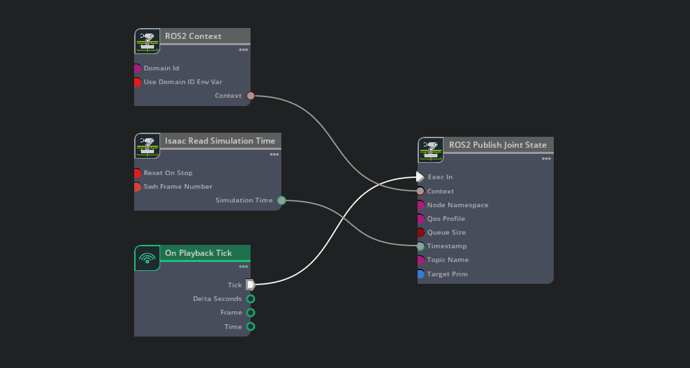

# Working with ROS
Isaac IMI was designed to work with **Isaac Sim 4.5.0** and **ROS2 Humble**. You can add ROS functionality to each robot in the simulation by writing a robot plugin. This page outlines a few things to keep in mind when writing these plugins.

## ROS interface
When writing a robot plugin, there are two ways to interface with ROS.
### 1. Using `self.ros_node`
Each robot instance contains (at most) one ROS node. The same node is exposed to all plugins that are attached to the robot. As a developer, you can access this node in any plugin you write with `self.ros_node`. For example, the following plugin creates a subscriber to the `/cmd_vel` topic by accessing the ROS node of any robot it attaches to:

```python title="my_robot_plugin.py"
from isaacimi.robot_plugin import ImiRobotPlugin
from geometry_msgs.msg import Twist

class MyRobotPlugin(ImiRobotPlugin):
    def on_plugin_load(self):
        self.ros_node.create_subscription(Twist, "/cmd_vel", self.twist_cmd_callback, 1)
        return
```

If none of the plugins attached to a robot access `self.ros_node`, a ROS node will not exist for that robot. The creation of nodes is managed internally by the `RosManager`. 

### 2. Using action graphs
Since Isaac Sim provides action graphs with ROS functionality out of the box, you can use these action graphs in your plugins. For example, the following action graph publishes the joint states of the robot at the specified `Target Prim` to the specified `Topic Name`: 

You can add this action graph to your robot by writing the following plugin:
```python title="my_joint_state_publisher_plugin.py"
from isaacimi.robot_plugin import ImiRobotPlugin
import omni.graph.core as og

class JointStatePublisherPlugin(ImiRobotPlugin):
    def on_plugin_load(self, topic_name):
        self.topic_name = topic_name
        return
    
    def set_up_scene(self, robot, scene):
        try:
            og.Controller.edit(
                {"graph_path": f"{robot.prim_path}/JointStatePublisherGraph", "evaluator_name": "execution"},
                {
                    og.Controller.Keys.CREATE_NODES: [
                        ("OnPlaybackTick", "omni.graph.action.OnPlaybackTick"),
                        ("PublishJointState", "isaacsim.ros2.bridge.ROS2PublishJointState"),
                        ("ReadSimTime", "isaacsim.core.nodes.IsaacReadSimulationTime"),
                    ],
                    og.Controller.Keys.CONNECT: [
                        ("OnPlaybackTick.outputs:tick", "PublishJointState.inputs:execIn"),
                        ("ReadSimTime.outputs:simulationTime", "PublishJointState.inputs:timeStamp"),
                    ],
                    og.Controller.Keys.SET_VALUES: [
                        # Note: the robot.prim_path property will return the articulation root of the robot
                        ("PublishJointState.inputs:targetPrim", robot.prim_path),
                        ("PublishJointState.inputs:topicName", self.topic_name),
                        ("PublishJointState.inputs:nodeNamespace", robot.name)
                    ],
                }
            )
        except Exception as e:
            print(e)
        return
```
Now, if you atttach this plugin to any robot in the simulation, the joint states of that robot will be published to the specified `/nodeNamespace/topicName` topic.

!!! note
    It is recommended to use `self.ros_node` when adding ROS functionality to a robot unless using an action graph makes it significantly easier. For example, using an action graph to publish joint states is easier than manually querying all joints in the `robot` object ourselves and writing our own publisher with `self.ros_node.create_publisher()`. 

## Namespacing
All ROS nodes accessed by `self.ros_node` have a namespace that matches the name of the robot (as specified in the simulation blueprint). For example, if the name of the robot is `robot1`, the name of the ROS node for that robot is `/robot1/isaacsim_node`.

Additionally, when using `self.ros_node` to publish and subscribe to topics, if the provided topic name does not have a `/` at the beginning, the node namespace is automatically prepended to the topic name (this is the expected behaviour when working with ROS). For example, if the following two plugins were attached to a robot named `robot1`, there would be one ROS node with two subscribers &ndash; one that listens to the `/cmd_vel` topic, and one that listens to the `/robot1/cmd_vel` topic:
```python title="my_robot_plugins.py"
class MyRobotPlugin(ImiRobotPlugin):
    def on_plugin_load(self):
        # listens to the /cmd_vel topic
        self.ros_node.create_subscription(Twist, "/cmd_vel", self.twist_cmd_callback, 1)
        return

class MyOtherRobotPlugin(ImiRobotPlugin):
    def on_plugin_load(self):
        # listens to /robot1/cmd_vel
        self.ros_node.create_subscription(Twist, "cmd_vel", self.twist_cmd_callback, 1)
        return
```

!!! warning
    When using action graphs for ROS functionality, an explicit input for `nodeNamespace` and `topicName` is usually available in the action graph node. You must set the `nodeNamespace` input explicitly if you want a namespace to be prepended to the `topicName`. 

## Transform broadcasting and listening
All ROS nodes returned via `self.ros_node` contain the following remapping:

- `/tf` to `tf`
- `/tf_static` to `tf_static`

This remapping effectively makes transform broadcasters and listeners in the node use `/namespace/tf` and `/namespace/tf_static` instead of `/tf` and `/tf_static`, where `namespace` is the name of the robot the node belongs to (as specified in the simulation blueprint).

## Callback execution
The [simulation loop](../reference/execution-order.md/#simulaton-loop) is ran in a main process. Every loop, the ROS nodes of each robot are checked for an available callback. If a callback is available, that callback will be executed by a worker thread. One callback will begin execution per simulation loop, or none if there are no callbacks available.

A single `MultiThreadedExecutor` is used to execute all callbacks across all ROS nodes so **callbacks between nodes** are executed concurrently. For example, given a simulation with `robot1` and `robot2`, where each robot contains a ROS node that subscribes to their respective topics `/robot1/cmd_vel` and `robot2/cmd_vel`, the callback for `robot1` may start execution in the first simulation loop, and the callback for `robot2` may start in the second simulation loop immediately after, and both callbacks run concurrently.

To execute **callbacks within the same node** concurrently, they need to be added to the `ReentrantCallbackGroup`, as described in the [official ROS2 Humble documentation](https://docs.ros.org/en/humble/How-To-Guides/Using-callback-groups.html).

